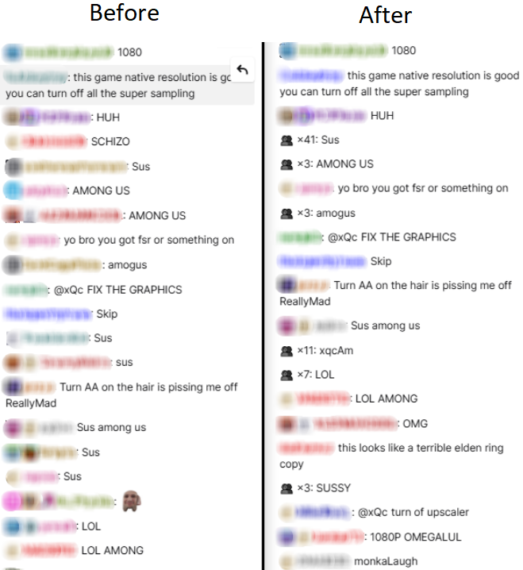

# Twitch Chat Deduplicator

A Chrome extension that cleans up repeated messages in live Twitch chat by hiding duplicates and grouping similar messages into a single entry.

## Features

- Hides duplicate chat messages
- Shows repeat counts in a grouped format (e.g. "👥 x3: message")
- Groups spammy one-character messages like "???" and "?????" into a single line
- Optional fuzzy matching using Levenshtein distance
- Customisable via the options page:
  - Debug logging (Default: disabled)
  - Message cache lifetime (Default: 60 seconds)
  - Maximum message cache size (Default: 10,000)
  - Ignore case sensitivity (Default: enabled)
  - Use Levenshtein matching (Default: enabled)
    - Levenshtein similarity threshold (Default: 90%)

## Usage

1. Install from the Chrome Web Store
2. Navigate to a live Twitch stream
3. Repeated messages will be automatically hidden or grouped

## Options

Accessible via:
> chrome://extensions/ → Click the extension → “Options”

All settings are stored using chrome.storage.sync and apply immediately.

## Privacy

This extension does not collect or transmit any personal data. All processing happens locally in your browser.

## Development

1. Clone or download this repository
2. Go to chrome://extensions/
3. Enable "Developer Mode"
4. Click "Load unpacked" and select the project folder

## License

This project is licensed under the MIT License. You are free to use, modify, and distribute it with or without changes.

MIT © 2025 AngusWR
